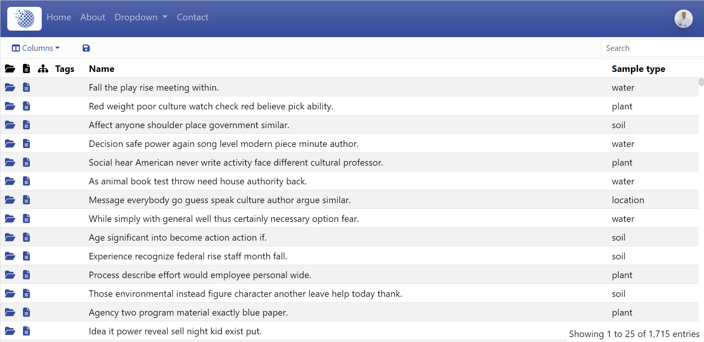

(functionality/exploration)=
# Data Exploration & Consumption

Data exploration, consumption and reuse is the core purpose of the Geoluminate framework. The framework is designed to provide a robust, user-friendly interface for exploring and consuming **high-quality** data that your community can rely on. For the humans among us, data can be explored via catalogues of projects, datasets and featured literature items that are available within the application. Data can be downloaded in neatly packaged bundles in the formats that make sense to you. For those of a more digital persuasion, data can be consumed via a RESTful API that provides access to all of the data that is available within the application. 


## Browsing Projects and Datasets

Browsing publicly available projects or datasets is simple and intuitive via the web interface. Filters that tap into rich metadata can help you find exactly what you're looking for. Whether that is a specific project, a dataset that has been published by a particular author, or a dataset that has been published in a particular journal.

<!-- Make use of discovery tags to find ongoing projects and datasets that are relevant to your research. -->

:::{figure-md}
{}

Figure 1. Standard catalogue view for browsing datasets.
:::


If you're not looking for a particular resource, try querying a particular sample or measurement type **across** datasets with one of the Tabular View's. The beautify of Geoluminate's enforced [data schema](dev_guide/data_schema)s is that the data the community collects are stored and indexed in individual fields within a dedicated database table. This means you can easily query and filter across multiple fields for a given data type, regardless of provenance.

:::{figure-md}
{}

Figure 2. Tabular view for browsing samples and measurements.
:::

## Detail Views

The following database entries can be viewed in detail via the web interface:

- [Projects](functionality/projects)
- [Datasets](functionality/datasets)
- [Samples](functionality/samples)
- [Locations](functionality/locations)


### Via the API

All Geoluminate web portals feature a consistent RESTful API that can be used to access all of the data that is available within the application. The API is designed to be as flexible as possible, allowing you to query and filter data in a number of ways. The API is also designed to be as performant as possible, with a number of optimisations in place to ensure that you can get the data you need as quickly as possible.

Consistent API's across all Geoluminate web portals means that you can easily harvest high-quality research data from multiple sources. The API is designed to be as flexible as possible, allowing you to query and filter data in a number of ways. The API is also designed to be as performant as possible, with a number of optimisations in place to ensure that you can get the data you need as quickly as possible.

:::{figure-md}
{}

Figure 3. Default API Documentation for Geoluminate powered databases.
:::

:::{figure-md}
{}

Figure 4. Default API Documentation for Geoluminate powered databases.
:::

```{note}
Be aware that their are typically rules and restrictions in place for each portal to prevent abuse. For example, you may be limited to a certain number of requests per minute, or you may be limited to a certain number of requests per day. If you are planning on using the API to harvest data from a portal, please contact the portal administrator to discuss your requirements.
```

